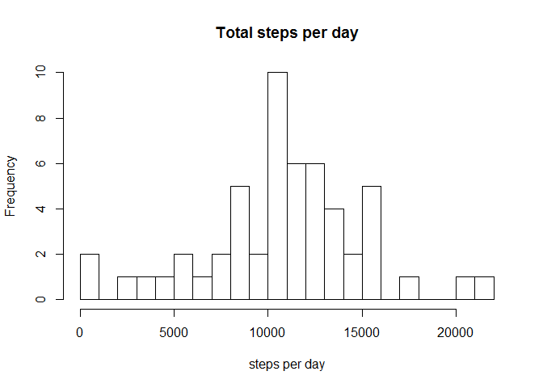
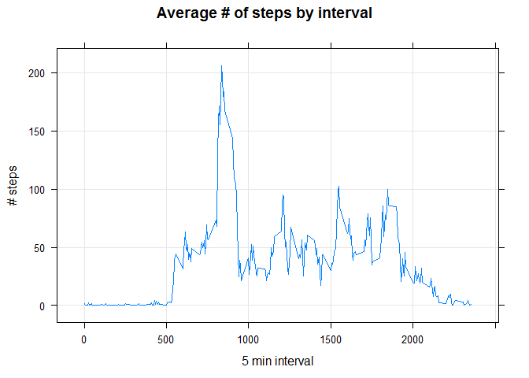
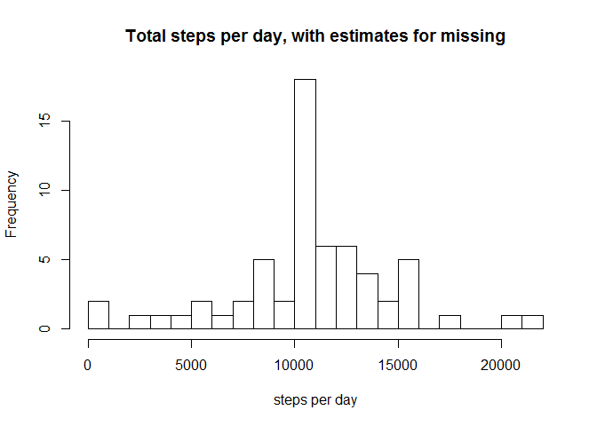
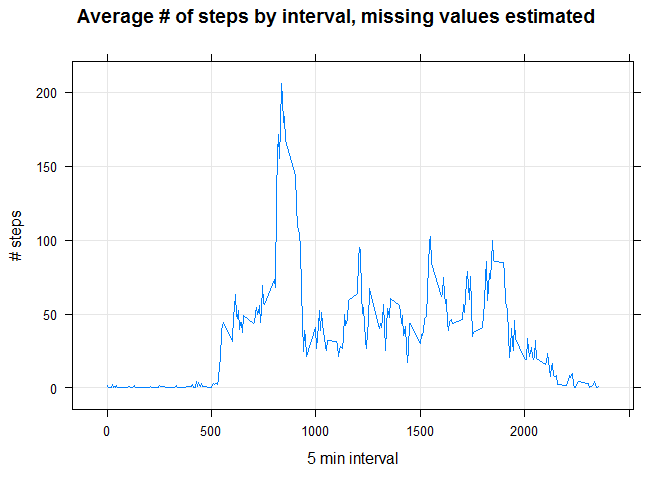
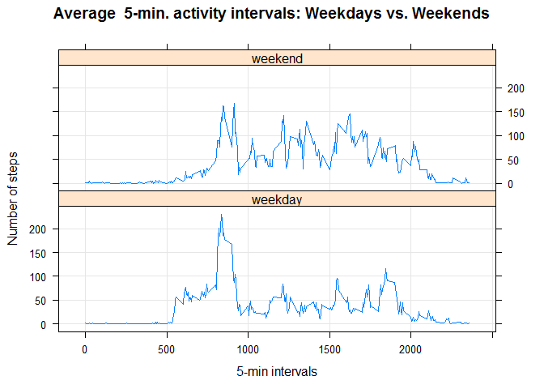

# Reproducible Research: Peer Assessment 1


Before we start, we make sure all r code chunks will be outputted as per instructions:

```r
knitr::opts_chunk$set(echo = TRUE)
```

And we grab the lattice library for our graphing:

```r
library(lattice)
```

# Introduction

This is the first course project for the Reproducible Data Class of the Data Science track at Coursera. 

In this project, we process and summarize the results of a file containing data from a personal activity monitoring device, taken in 5 minute intervals through out the day. The data consists of two months of data from an anonymous individual collected during the months of October and November, 2012 and include the number of steps taken in 5 minute intervals each day.

The dataset has a total of 17568 observations, and is stored in a csv. 

## Loading and preprocessing the data

To begin, we unzip and read the file into our activityData variable:


```r
unzip("activity.zip", exdir = "./data")
activityData <- read.csv("./data/activity.csv")
```

And then we have a look at the structure:


```r
str(activityData)
```

```
## 'data.frame':	17568 obs. of  3 variables:
##  $ steps   : int  NA NA NA NA NA NA NA NA NA NA ...
##  $ date    : Factor w/ 61 levels "2012-10-01","2012-10-02",..: 1 1 1 1 1 1 1 1 1 1 ...
##  $ interval: int  0 5 10 15 20 25 30 35 40 45 ...
```

The variables included are:

- steps: Number of steps taking in a 5-minute interval (missing values are coded as NA)
- date: The date on which the measurement was taken in YYYY-MM-DD format
- interval: Identifier for the 5-minute interval in which measurement was taken

Now to clean things up a bit we'll change those dates from strings into dates


```r
activityData$date <- as.Date(activityData$date)
```


## What is mean total number of steps taken per day?

Now, we calculate the total, mean and median steps per day


```r
#
totalStepsPerDay <- aggregate(steps ~ date, data=activityData, FUN="sum")
meanStepsPerDay <- round(mean(totalStepsPerDay$steps, na.rm = TRUE),4)
medianStepsPerDay <- median(totalStepsPerDay$steps,na.rm = TRUE)
```

And then build a histogram of the steps per day data:  

```r
hist(totalStepsPerDay$steps,breaks = 20, main="Total steps per day", xlab="steps per day")
```

<!-- -->

The mean # of steps taken per day: 1.0766189\times 10^{4}  
The median # of steps taken per day: 10765


## What is the average daily activity pattern?

Now we need to make a time series plot of the 5 minute interval and the average number of steps taken across the days. We're using xyplot from lattice for this one:


```r
avgStepsPerInterval <- aggregate(steps ~ interval, data=activityData, FUN="mean")
xyplot(steps ~ interval, data=avgStepsPerInterval, type="l", grid=TRUE, ylab="# steps", xlab="5 min interval", main="Average # of steps by interval")
```

<!-- -->

To understand which interval has the highest number of steps on average, we use:


```r
maxInterval <- avgStepsPerInterval$interval[which.max(avgStepsPerInterval$steps)]
```

The interval with the highest average number of steps per day is: 835


## Imputing missing values

There are a number of intervals with missing data, marked as NA. To calculate the number of intervals with missing data, we use:


```r
naSteps <- sum(is.na(activityData$steps))
naDate <- sum(is.na(activityData$date))
naInterval <- sum(is.na(activityData$interval))
```

There are 2304 missing values in the steps variable, 0 missing values in the date variable and 0 missing values in the interval variable.

To fix that missing data in the steps variable, we need to replace the NAs with the average value of that interval across all of our dates -- let's take a look at those averages now:


```r
str(avgStepsPerInterval)
```

```
## 'data.frame':	288 obs. of  2 variables:
##  $ interval: int  0 5 10 15 20 25 30 35 40 45 ...
##  $ steps   : num  1.717 0.3396 0.1321 0.1509 0.0755 ...
```

## replacing the missing data

We need to create a new dataset with the NA values filled in:


```r
# clone the dataset 
activityData_NoNa <- activityData

# for each row, check for NA and replace with that interval's average calculated previous 
for(r in 1:nrow(activityData_NoNa)){
  if (is.na(activityData_NoNa$steps[r])) {
  activityData_NoNa$steps[r] <- avgStepsPerInterval$steps[avgStepsPerInterval$interval == activityData_NoNa$interval[r]]
  }
}
```

Now let's confirm it worked:


```r
naNow <- sum(is.na(activityData_NoNa$steps))
```

Assuming all is well, this should read zero: 0

## Histogram revisited

Now let's take another look at that histogram of the daily total steps, using our new dataset. First we build new averages and medians per day.


```r
#
totalStepsPerDay_NoNa <- aggregate(steps ~ date, data=activityData_NoNa, FUN="sum")
meanStepsPerDay_NoNa <- round(mean(totalStepsPerDay_NoNa$steps),4)
medianStepsPerDay_NoNa <- median(totalStepsPerDay_NoNa$steps)
```

Now for the histogram:


```r
hist(totalStepsPerDay_NoNa$steps,breaks = 20, main="Total steps per day, with estimates for missing", xlab="steps per day")
```

<!-- -->

Looks pretty similar to our previous histogram. How about the mean and median values?

Our mean when ignoring NA values was: 1.0766189\times 10^{4}  
Our new mean after replacing the NA values with averages is: 1.0766189\times 10^{4}  

Our median when ignoring NA values was: 10765  
Our new median after replacing the NA values with averages is: 1.0766189\times 10^{4}  

** CONCLUSION: In this case, using estimations for the missing values didn't alter the overall histogram shape, and had very small if any changes to the mean or median values per day.**

Now, let's look at our time series plot again:


```r
avgStepsPerInterval_NoNa <- aggregate(steps ~ interval, data=activityData_NoNa, FUN="mean")
xyplot(steps ~ interval, data=avgStepsPerInterval_NoNa, type="l", grid=TRUE, ylab="# steps", xlab="5 min interval", main="Average # of steps by interval, missing values estimated")
```

<!-- -->

## Are there differences in activity patterns between weekdays and weekends?

For this final part of the assignment, we'll see if there's a difference between the average steps per interval over a regular weekday vs a weekend day.

We start by using the weekday() function to create a new factor variable in the dataset showing whether the day was a weekend or weekday:


```r
activityData_NoNa$day <- "weekday"
activityData_NoNa$day[weekdays(activityData_NoNa$date) %in% c("Saturday","Sunday") ] <- "weekend"
activityData_NoNa$day <- as.factor(activityData_NoNa$day)
str(activityData_NoNa)
```

```
## 'data.frame':	17568 obs. of  4 variables:
##  $ steps   : num  1.717 0.3396 0.1321 0.1509 0.0755 ...
##  $ date    : Date, format: "2012-10-01" "2012-10-01" ...
##  $ interval: int  0 5 10 15 20 25 30 35 40 45 ...
##  $ day     : Factor w/ 2 levels "weekday","weekend": 1 1 1 1 1 1 1 1 1 1 ...
```

```r
table(activityData_NoNa$day)
```

```
## 
## weekday weekend 
##   12960    4608
```

Now, we need to recreate the stacked graph as shown in the example:


```r
avgPerInterval_Day <- aggregate(steps ~ interval + day, data=activityData_NoNa, FUN="mean")
xyplot(steps ~ interval | day, data=avgPerInterval_Day, type="l", grid=T, layout=c(1,2), ylab="Number of steps", xlab="5-min intervals", main="Average  5-min. activity intervals: Weekdays vs. Weekends")
```

<!-- -->

** based on the graphs, it looks like the users steps per interval over the weekend were far more distributed and overall higher -- where on weekdays the highest steps per interval were clearly concentrated in the morning **


